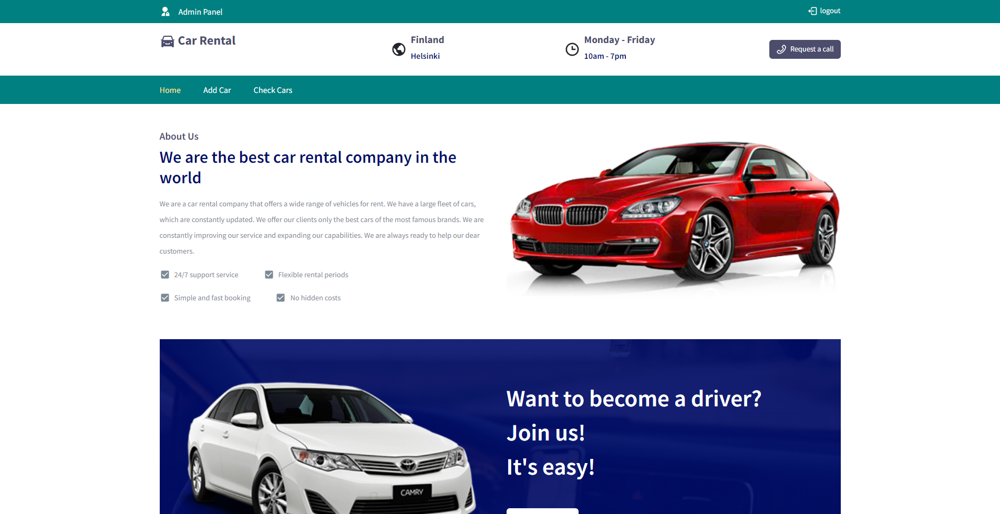
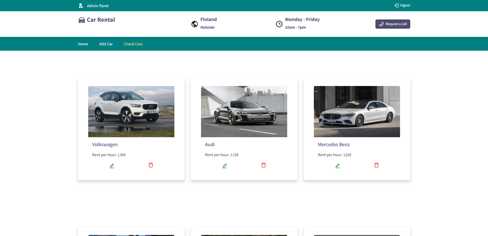

## Car Rental MERN-STACK





## Installation

1- Clone the repo

```bash
https://github.com/capo33/rent-car-frontend
```

2- Install dependencies

```bash
yarn
```

## Usage

1- Go to the root directory and run the command

```
yarn start
```

## Tech

- [React]
- [JavaScript]

[React]: https://react.dev/
[JavaScript]: https://developer.mozilla.org/en-US/docs/Web/JavaScript/
